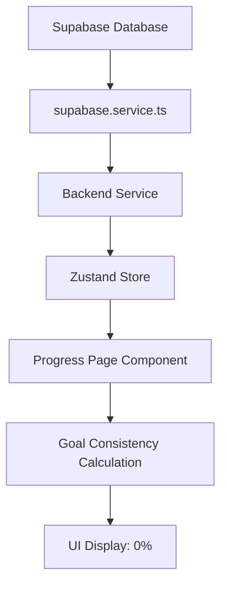

# Consistency Score Data Flow Analysis
Created: 2025-01-21

## 🔴 PROBLEM STATEMENT
JHJH user shows 0% consistency in Progress page despite having completed activities over past week and a half.

## 📊 DATA FLOW DIAGRAM



## 🗄️ DATABASE SCHEMA

### Table: `actions`
```sql
- id: UUID
- user_id: UUID
- title: string
- goal_id: UUID (nullable)
- completed: boolean
- completed_at: timestamp (nullable)
- created_at: timestamp
- time: string
```

**Note**: There is NO `daily_actions` table - code was trying to use non-existent table!

## 📁 KEY FILES & FUNCTIONS

### 1. DATA FETCHING LAYER

#### `/src/services/supabase.service.ts`

**Function: `getDailyActions()`**
```typescript
// Line 245-291
- Fetches from 'actions' table
- Includes goal relationship
- MODIFIES 'completed' field: only true if completed_at is TODAY
- Returns: action.completed = (completed_at >= today)
```

**Function: `completeAction(id)`**
```typescript
// Line 348-374
- Updates 'actions' table
- Sets completed: true
- Sets completed_at: now()
```

**Function: `getTodaysCompletedActions()`**
```typescript
// Line 397-441
- Fetches from 'actions' table WHERE completed_at >= today
- Returns CompletedAction format
- ERROR: Was looking for 'daily_actions' table (doesn't exist)
```

### 2. STATE MANAGEMENT LAYER

#### `/src/state/slices/actionsSlice.ts`

**State Structure:**
```typescript
{
  actions: Action[]           // Daily actions
  completedActions: CompletedAction[]  // Today's completed only
  isLoading: boolean
  error: string | null
}
```

**Key Functions:**
- `fetchDailyActions()` - Calls getDailyActions(), stores in state
- `fetchTodaysCompletedActions()` - FAILS due to table error

### 3. UI LAYER

#### `/src/features/progress/ProgressMVPEnhanced.tsx`

**Line 45**: `const completedActions = useStore(s => s.completedActions);`
- Gets completed actions from store (BUT THIS IS EMPTY due to error!)

**Line 69-151**: Weekly consistency calculation
```typescript
// Fetches directly from 'actions' table
// Counts completed_at timestamps in last 7 days
// Sets weeklyStats state
```

**Line 245-267**: `getGoalConsistency(goalId)`
```typescript
// OLD: Used completedActions (broken)
// CURRENT: Checks action.completed_at || action.completedAt
// Returns: (completedCount / totalCount) * 100
```

## 🔍 DATA TRANSFORMATION POINTS

### Point 1: getDailyActions() - Line 277-286
```typescript
// CRITICAL: Overrides 'completed' to only show TODAY's status
return {
  ...action,
  completed: completedToday,  // <-- MODIFIED HERE
  completedAt: action.completed_at  // Original timestamp preserved
}
```

### Point 2: Goal Cards Calculation
```typescript
// Uses actions from store
const goalActions = actions.filter(a => a.goalId === goalId);
// Checks completed field (which is TODAY only!)
```

## 🐛 ROOT CAUSE ANALYSIS

### Problem Chain:
1. ✅ User completes actions → `completed_at` saved to DB
2. ✅ `getDailyActions()` fetches all actions
3. ❌ `getDailyActions()` sets `completed: false` if not completed TODAY
4. ✅ Actions stored in Zustand with `completed: false`
5. ❌ Progress page uses `completed` field → sees all as incomplete
6. ❌ Consistency shows 0%

### Additional Issues:
- `completedActions` array is empty (getTodaysCompletedActions fails)
- Was trying to query non-existent 'daily_actions' table
- Fixed to use 'actions' table but historical data may be missing

## 🔧 WHAT WE'VE TRIED

1. **Fixed table references**
   - Changed 'daily_actions' → 'actions' everywhere
   - Result: Still 0%

2. **Modified getGoalConsistency()**
   - Changed to check `completed_at` instead of `completed`
   - Result: Still 0%

3. **Added Fix Data button**
   - Would populate missing `completed_at` timestamps
   - Problem: Button doesn't work (Alert not showing on web)

## 📝 CURRENT STATE OF DATA

From console logs:
- User ID: `bcd3d06b-b74d-4b6b-8b53-5e4249828a2a`
- Email: `gnbhg@uhjkg.com` (not JHJH?)
- Actions: 6 total
- Goals: 2 ("Hit 10,000 monthly listeners on Spotify", "Jing Cultivation")
- Completed today: 0
- Historical completed: Unknown (need to check DB directly)

## ❓ CRITICAL QUESTIONS

1. **Does JHJH's data have `completed_at` timestamps?**
   - Need to check: Are there any non-null `completed_at` values?

2. **Is the user actually JHJH?**
   - Console shows email: gnbhg@uhjkg.com
   - Need to verify correct user

3. **What's in the actions array?**
   - Need to log the actual action objects with their fields

## 🎯 NEXT STEPS

1. **Add comprehensive logging** to see actual data:
```typescript
console.log('Actions from store:', actions);
console.log('Goal actions:', goalActions);
console.log('Completed at values:', goalActions.map(a => a.completed_at));
```

2. **Check database directly** for JHJH:
```sql
SELECT * FROM actions
WHERE user_id = '[JHJH_USER_ID]'
AND completed_at IS NOT NULL;
```

3. **Fix the data flow**:
   - Option A: Don't override `completed` field in getDailyActions
   - Option B: Add separate `completedToday` field
   - Option C: Fetch raw data separately for Progress page

4. **Create test data** to verify calculation works:
```typescript
// Manually set completed_at for testing
const testAction = { ...action, completed_at: '2025-01-20T10:00:00Z' };
```