# Data Flow Diagrams

## Visual Data Flows for Key User Journeys

### 1. User Onboarding Flow

### 2. Daily Action Completion Flow

### 3. Consistency Calculation Data Flow

```mermaid
graph TB
    A[Component Needs Stats] --> B[Call getGoalCompletionStats]
    B --> C[For Each Goal]
    C --> D[Get Goal Creation Date]
    D --> E[Calculate Days Active]
    E --> F[Count Linked Actions]
    F --> G[Expected = Actions × Days]
    G --> H[Query action_completions]
    H --> I[Count Completed]
    I --> J[Calculate Percentage]
    J --> K[Add to Results Map]
    K --> C
    K --> L[Return All Stats]
    L --> M[Update UI Display]
```

### 4. Circle Leaderboard Flow

### 5. Social Post Creation Flow

### 6. Daily Review Submission Flow

## State Management Flow

### 7. Zustand State Update Cycle

### 8. Authentication State Flow

## Database Transaction Flows

### 9. Action Creation with Goal Link

### 10. Consistency Recovery Flow

## Real-time Data Flows

### 11. Real-time Circle Updates

### 12. Push Notification Flow (Future)

## Error Handling Flows

### 13. API Error Recovery

### 14. Data Sync Flow

## Performance Optimization Flows

### 15. Lazy Loading Pattern

### 16. Cache Strategy Flow

## Key Data Flow Principles

### 1. Optimistic Updates
- Update UI immediately
- Sync with backend async
- Revert on failure

### 2. Single Source of Truth
- Database is authoritative
- Local state for performance
- Sync regularly

### 3. Fail Gracefully
- Queue offline actions
- Show cached data
- Retry with backoff

### 4. Security First
- RLS on all tables
- Validate on backend
- Never trust client

### 5. Performance Patterns
- Lazy load lists
- Debounce searches
- Cache frequently used
- Batch operations

## Quick Reference: Data Flow Entry Points

| User Action | Entry Point | Data Flow |
|------------|-------------|-----------|
| Check action | `dailySlice.toggleAction()` | Flow #2 |
| View progress | `getGoalCompletionStats()` | Flow #3 |
| Join circle | `joinCircle()` | Flow #4 |
| Create post | `createPost()` | Flow #5 |
| Complete review | `saveDailyReview()` | Flow #6 |
| Open app | `checkAuth()` | Flow #8 |
| Create goal | `createGoal()` | Flow #9 |

## Tools for Visualization

To render these diagrams:
1. **Mermaid Live Editor**: https://mermaid.live
2. **VS Code Extension**: Mermaid Preview
3. **GitHub**: Renders mermaid blocks automatically

---

Last Updated: September 23, 2025
Next: See DATA_ARCHITECTURE.md for detailed schema