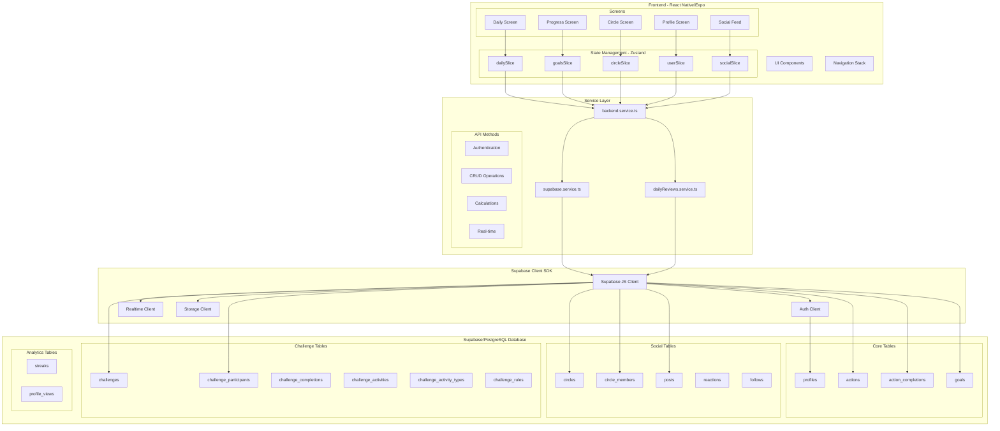
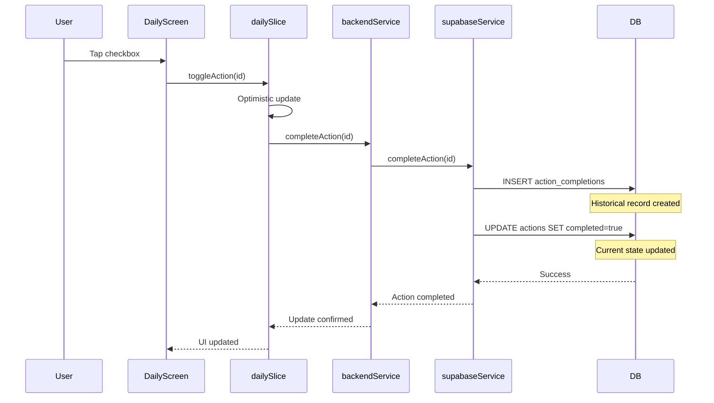
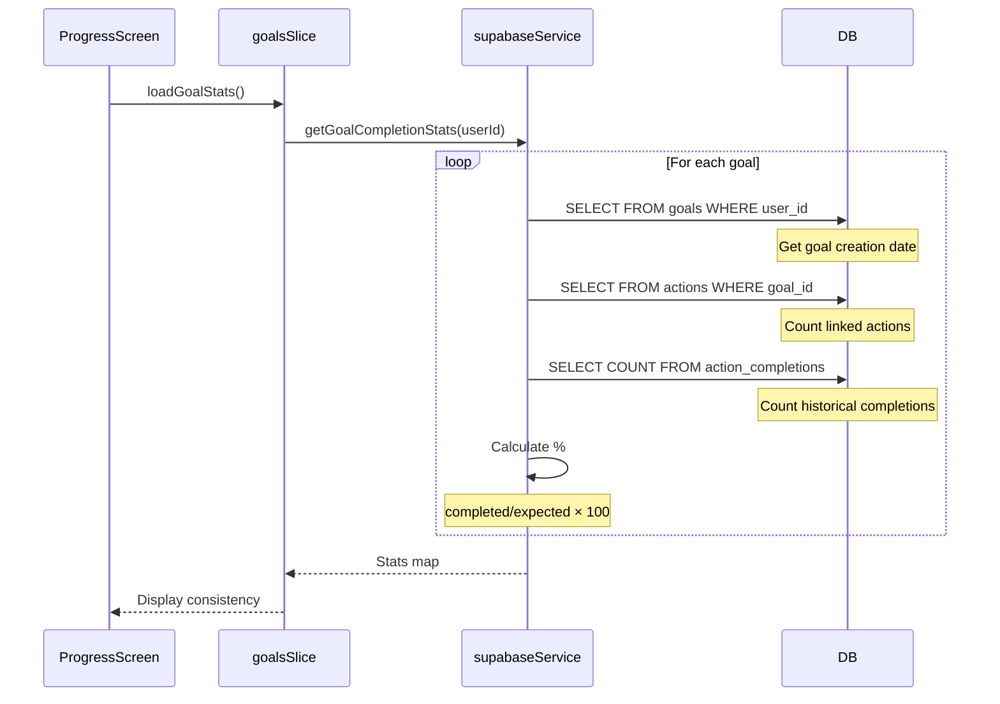
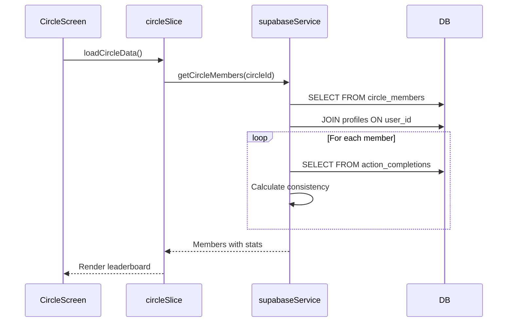
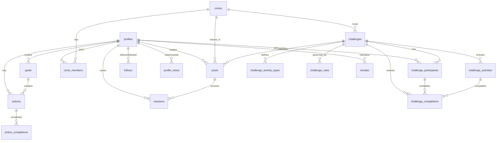

# Visual Architecture Diagram - Challenge Implementation App

## Complete Data Flow Architecture



## Detailed Data Flow Patterns

### 1. Daily Action Completion Flow


### 2. Consistency Calculation Flow


### 3. Circle Leaderboard Flow


## Database Relationships



## Key API Endpoints & Data Flow

### Authentication Flow
```
Frontend → supabase.auth.signIn() → Supabase Auth → profiles table
Frontend → supabase.auth.signUp() → Supabase Auth → trigger → profiles table
```

### Daily Actions
```
Frontend → getTodaysActions(userId) → actions WHERE date=today → Return list
Frontend → completeAction(id) → INSERT action_completions + UPDATE actions
Frontend → uncompleteAction(id) → DELETE FROM action_completions + UPDATE actions
```

### Goals & Consistency
```
Frontend → getUserGoals(userId) → goals WHERE user_id → Return goals
Frontend → getGoalCompletionStats(userId) →
    → goals (get creation dates)
    → actions (count per goal)
    → action_completions (count completed)
    → Calculate percentage
```

### Circles & Social
```
Frontend → joinCircle(code) → circles WHERE invite_code → INSERT circle_members
Frontend → getCircleMembers(circleId) → circle_members JOIN profiles
Frontend → createPost(post) → INSERT posts → Real-time broadcast
Frontend → getPosts(filter) → posts JOIN profiles → Apply visibility rules
```

### Challenges
```
Frontend → getActiveChallenges(circleId) → challenges WHERE circle_id AND is_active
Frontend → joinChallenge(challengeId) → INSERT challenge_participants
Frontend → logChallengeActivity(activityId) → INSERT challenge_completions
Frontend → getChallengeLeaderboard(challengeId) →
    → challenge_participants
    → challenge_completions (COUNT)
    → challenge_rules (apply)
```

## Real-time Subscriptions

```javascript
// Circle member updates
supabase.channel('circle-updates')
  .on('postgres_changes', {
    event: '*',
    schema: 'public',
    table: 'circle_members',
    filter: `circle_id=eq.${circleId}`
  })

// New posts in feed
supabase.channel('social-feed')
  .on('postgres_changes', {
    event: 'INSERT',
    schema: 'public',
    table: 'posts'
  })

// Challenge completions
supabase.channel('challenge-progress')
  .on('postgres_changes', {
    event: 'INSERT',
    schema: 'public',
    table: 'challenge_completions',
    filter: `challenge_id=eq.${challengeId}`
  })
```

## Security Boundaries (RLS)

```sql
-- Users can only see their own actions
actions: auth.uid() = user_id

-- Users can only see public profiles or followed users
profiles: is_private = false OR id IN (SELECT following_id FROM follows WHERE follower_id = auth.uid())

-- Circle members can see circle content
posts: visibility = 'public' OR (visibility = 'circle' AND circle_id IN (SELECT circle_id FROM circle_members WHERE user_id = auth.uid()))

-- Challenge participants can log completions
challenge_completions: participant_id IN (SELECT id FROM challenge_participants WHERE user_id = auth.uid())
```

## Performance Optimizations

### Indexed Columns
- `actions`: user_id, date (compound index)
- `action_completions`: user_id, action_id, completed_at
- `posts`: user_id, created_at, circle_id, visibility
- `circles_members`: circle_id, user_id
- `challenge_completions`: participant_id, activity_id, completion_date

### Query Patterns
```sql
-- Efficient: Use indexes
SELECT * FROM actions WHERE user_id = ? AND date = ?

-- Efficient: Join with limit
SELECT p.*, pr.username
FROM posts p
JOIN profiles pr ON p.user_id = pr.id
WHERE p.visibility = 'public'
ORDER BY p.created_at DESC
LIMIT 20

-- Efficient: Aggregate with index
SELECT COUNT(*) FROM action_completions
WHERE user_id = ? AND completed_at >= ?
```

## Data Flow Summary

1. **Frontend Layer**: React Native screens interact with Zustand store
2. **State Management**: Zustand slices manage local state and call services
3. **Service Layer**: Abstraction between frontend and Supabase
4. **Supabase Client**: Handles auth, real-time, and database operations
5. **Database**: PostgreSQL with RLS policies ensuring data security

## Key Insights from Database Structure

1. **Comprehensive Challenge System**: Multiple tables for challenges, activities, rules, and completions
2. **Social Features**: Posts, reactions, follows, profile views
3. **Historical Tracking**: action_completions separate from actions for history
4. **Performance Focused**: Extensive indexing on frequently queried columns
5. **Security First**: RLS policies on all tables
6. **Analytics Ready**: streaks and profile_views tables for metrics

---

Last Updated: September 23, 2025
Based on actual database schema discovery